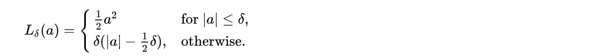
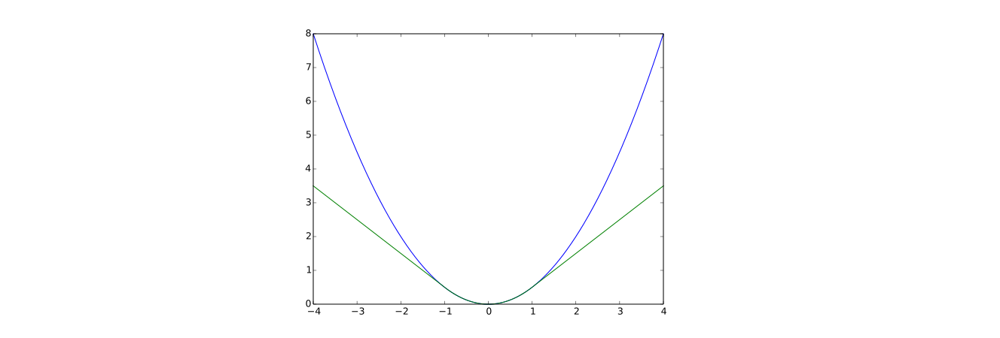
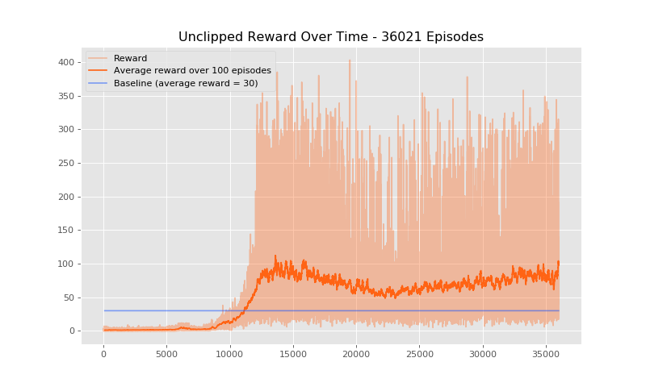
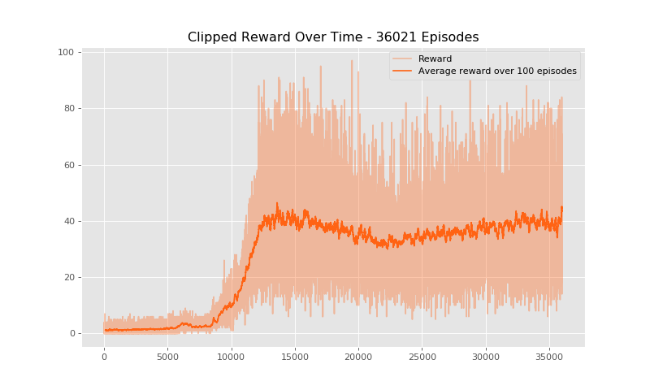
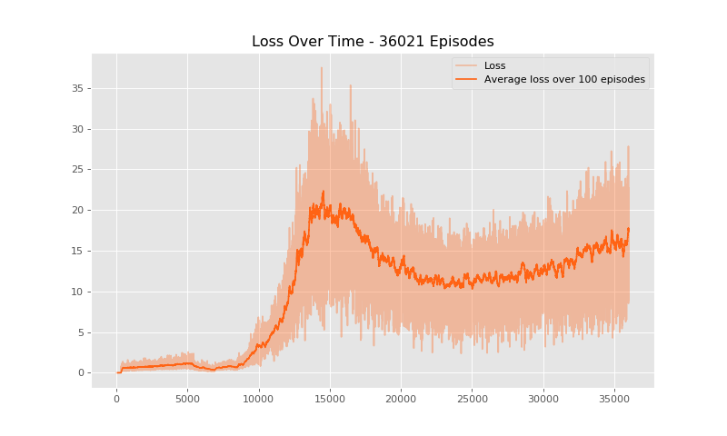
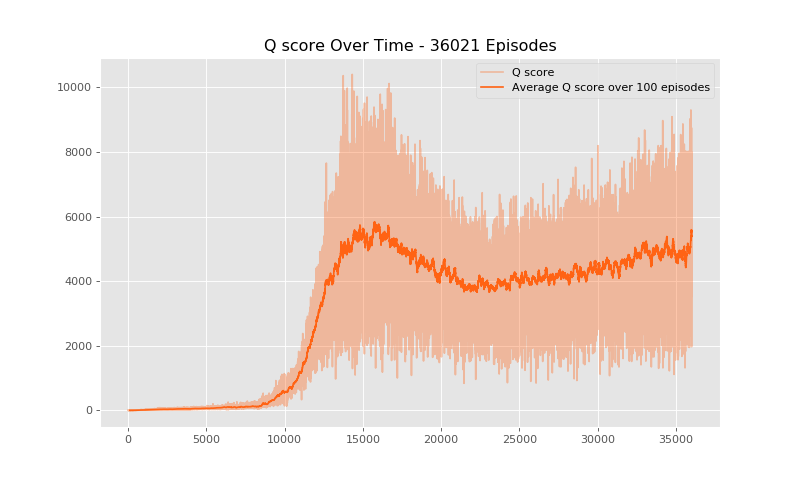

# Deep Q Learning : Atari Breakout
Our actor can achieve an average reward of about 80 over 100 episodes (we didn't have much time to tune the parameters...). We basically followed settings from the Deepmind Q Learning paper.

## Settings 
### Deep Q Learning with Experience Replay

Introducing experience replay and the target network, we have more stable input and output pairs to train our main network. The target Q values Q' is retrieved using the target network in the experience replay steps. We hope to match the actual Q value outputted by the main network with Q'.

### Preprocessing 
Each frame is converted to grayscale (single channel) and then resized to 84 * 84. We save each grayscale image * 255 as an np.int array since this saves memory (compared to floating point numbers), which is important in Q-learning since we have to keep a list of history data. 
   
The grayscale values are divided by 255 as the CNN input. We resorted to this solution since we encountered out-of-memory errors when we save the frames as floating point arrays.

### Model architecture 
Please refer to `./src/model.py`. The action space is set to have dimension 3 (left, right and fire/stay).

### Experience replay
We used a `deque` of maximum size 400000 to store the previous 400000 states. During each experience replay step, we sample 32 minibatches to train our actor network. 

### Loss function
The actor network outputs a scalar value for each action (Q-score), and chooses the action with the highest Q-score. We try to match the Q-score between the main network and the target network (thus acting like supervised learning). The loss between Q and Q' are computed using the huber loss.

The loss is linear outside a certain margin otherwise quadratic. This reduces dramatic changes in losses (and gradients) which often hurt RL.

The blue line is the original quadratic loss. The green line is the huber loss.

### Other training settings
- Batchsize (used to train history replay): 32
- Memory length: 400000
    - In each replay step, minibatch is sampled from this memory.
- Epsilon-greedy actions:
    - Initial probability: 1
    - Final probability: 0.01
    - Exploration steps: 1000000
    - Epsilon linear decay rate: (1 - 0.01) / 1000000
- Optimizer: RMSprop
    - Learning rate: 0.00025
    - Decay parameter: 0.95
- Reward discount factor: 0.99
- 4 previous frames concatenated as the actor network input (size 4 * 1 * 84 * 84).
- Target network update rate: every 10000 steps. Every 10000 steps, the weights are synchronized with the main actor network.
- Maximum number of no-op steps every episode: 30 (to avoid sub-optimal solutions)

## Result
### Unclipped reward

### Clipped reward (during training)

### Training loss

### Q-score
